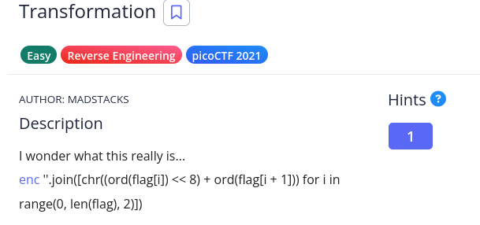
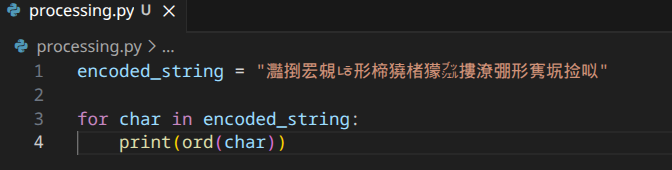

<h1>Transformation</h1>

From: https://play.picoctf.org/practice/challenge/104?category=3&difficulty=1&page=1

Author: MADSTACKS

Description: I wonder what this really is... enc ''.join([chr((ord(flag[i]) << 8) + ord(flag[i + 1])) for i in range(0, len(flag), 2)])

Tags: Easy, Reverse Engineering, picoCTF 2021
---

<h2>General Functionality</h2>

An ENC file is provided which supposed is a result of the python code in the description.



<h2>Experimentation</h2>
    
I started by processing each character and confirming that these were significantly high ASCII codes resulting from the bitshift operation on the ord() value of the original flag character.

I could determine that each character in the encoded string is a combination of the original ascii code value * 256 + the ascii code of the next character in the string.



Because the list comprehension is based off of an iterator working through the original flag string 2 characters at a time. The encoded string is half the length of the original flag.

If we assign the letters {a, b, c... z} to the sequence of characters in the original string and {a', b', c'... z'} to the charactes of the new string; we can represent characters of the new string as an algebraic formula.

a' = 256 * a + b

However, since we only know a', we can't technically find a and b algebraically. Fortunately, there is a slight misconfiguration in this encoding. Since we know every character in the original string is a base ascii value, its value is between 0-256. Similarly, since a' is a multiple of 256, there will be only one value for b in the range 0-256 which doesn't result in decimal value when solving for a'. Thus we can test for all possible values of b while trying to find each character of a from a'.

```
encoded_string = "灩捯䍔䙻ㄶ形楴獟楮獴㌴摟潦弸形㝦㘲捡㕽"

flag = []
for char in encoded_string:
    char_val = ord(char)
    for i in range(256):
        if ((char_val - i) / 256) % 1 == 0:
            real_char = int((char_val - i) / 256)
            flag.append(chr(real_char))
            flag.append(chr(i))

print("".join(flag))
```

Thus, we can get the flag! 
picoCTF{16_bits_inst34d_of_8_b7f62ca5}

